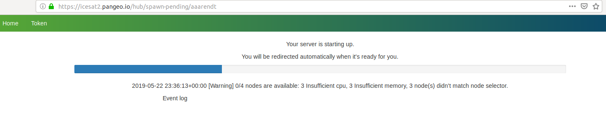

---

title: "Getting Connected to our Shared Computing Environment"
teaching: 15 
exercises: 0
questions:
- "Why are we using a shared cloud environment?"
- "How do I access the shared cloud environment?"   
- "What is Pangeo and how is this system configured?"
objectives:
- Try connecting to our shared cloud computing system
- Experiment with running a few lines of code
- Feel free to explore!
keypoints:
- JupyterHub provides a consistent environment within which we can work on tutorials and projects
- accessing JupyterHub servers requires a GitHub userid
- JupyterHub offers each participant their own separate Jupyter Notebook environment and disk space for storing temporary scripts and files
---

### Why are we using a shared cloud environment?

Teaching software to a diverse group of participants, each with different computers and operating systems, can be challenging. As you'll learn in the next lesson, there are specific ways to configure our software for the tutorials to be successful, so it takes time to get everyone set up consistently. Our solution to this is to give everyone access to a cloud computing environment that is pre-configured for the specific software we will deploy. This cloud computing instance can be accessed from any web browser, which eliminates the need for configuring each person's individual computer. 

We will encourage you to use our shared resources for all the tutorials, and you can optionally use this for your projects as well. We also hope you will practice installing Python libraries locally on your laptop so that you can continue working after leaving our event (see our next lesson for details).

### How do I access the shared cloud environment?

Access to our shared cloud environment is easy. Just click on [https://icesat2.pangeo.io](https://icesat2.pangeo.io)
 
 

 
 

Assuming you set up your GitHub credentials correctly (see the previous lesson), you can now click on the "Sign in with GitHub" button:

 
 

 
 

It will take a little bit of time for this to load - be patient! Once things are spun up you will see your very own instance of a [JupyterLab](https://jupyterlab.readthedocs.io/en/stable/) environment:

 
 

 
 

### What is Pangeo and how is this system configured?

[Pangeo](https://pangeo.io) is a community of researchers building computing tools to enable exploration of big datasets in the earth sciences. Several of us are involved in projects with NASA and NSF to build prototype systems to enable data discovery in the era of expanding data volume and complexity.

In a nutshell, we are using tools provided by a commercial cloud vendor (Amazon Web Services) to deploy multiple virtual computing instances that can be deployed on demand in a parallel computing node. As you were waiting for Pangeo to load, there were a series of AWS virtual machines being created to support your computing environment.

Pangeo uses JupyterHub as a way to give a Jupyter Notebook server to each person in a group. [These slides](https://www.slideshare.net/willingc/jupyterhub-a-thing-explainer-overview?from_action=save) give a nice overview of what JupyterHub is all about. We use JupyterHub in an educational setting because it enables us to quickly begin working with code without spending time to get the necessary libraries and dependencies set up on everyone's individual computers.

### How do I get my code in and out of Pangeo?

### How much space is allocated to me on Pangeo?

### How do I end my Pangeo session? Will I lose all of my work?